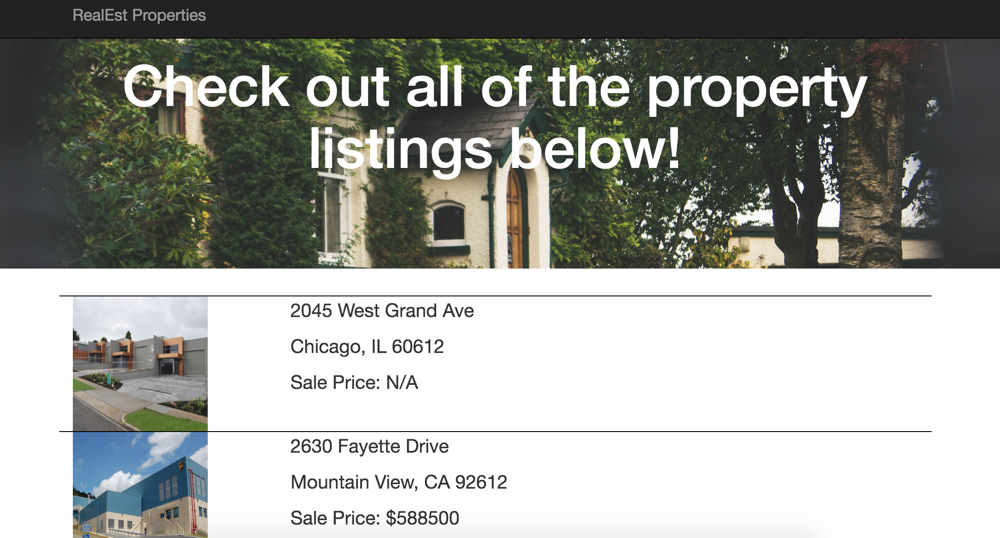
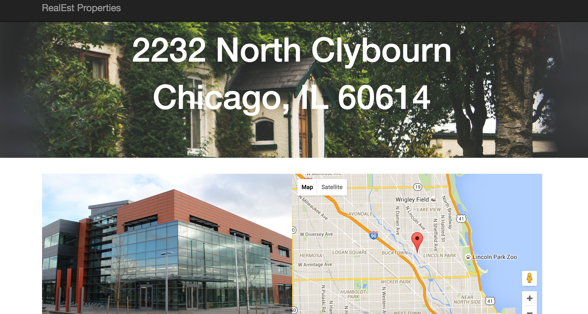
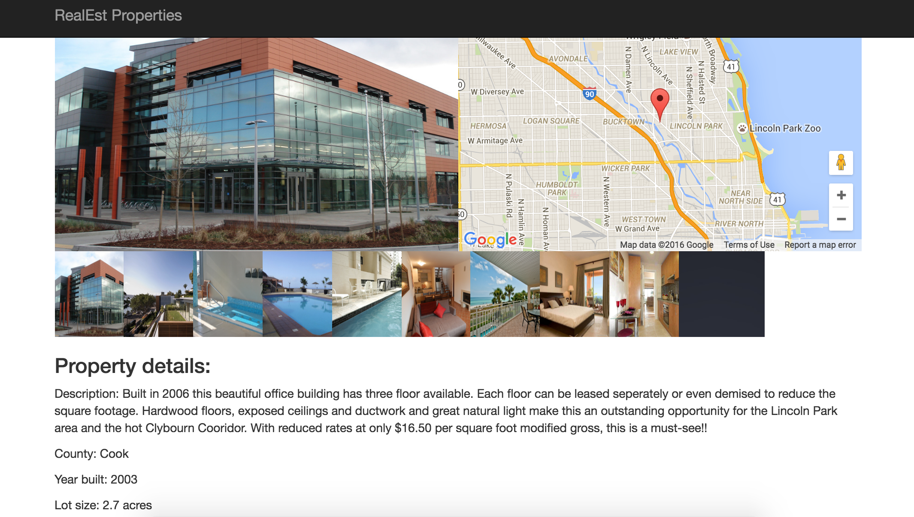

# RealEstProperties

## Description

A web application built using AngularJS and Bootstrap. The app incorporates the Google Maps API and is hosted on Heroku. It allows users to view a list of real estate property listings and the details of a particular listing when it is clicked.

Visit http://realestproperties.herokuapp.com/ to check out the project.

##Screenshots

